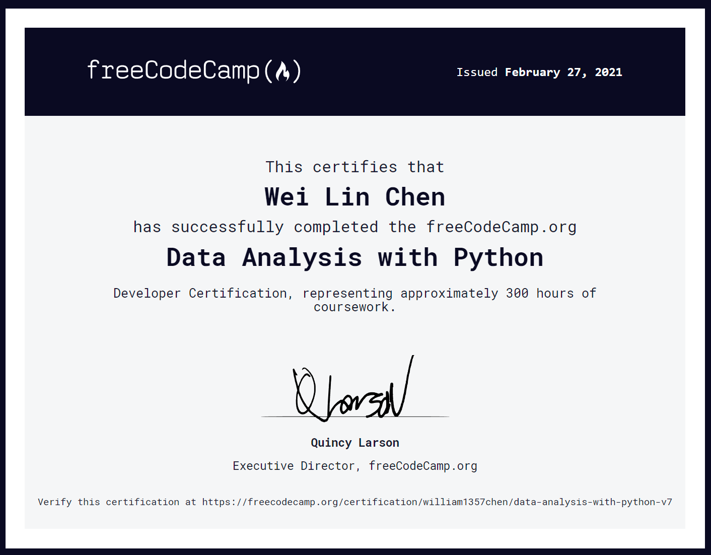

# freeCodeCamp Data Analysis with Python
These are the five projects for the Data Analysis with Python curriculum on freeCodeCamp.
 
## Project List
* [Mean Variance Standard Deviation Calculator](fcc-mean-variance-standard-deviation-calculator)
* [Demographic Data Analyzer](fcc-demographic-data-analyzer)
* [Medical Data Visualizer](fcc-medical-data-visualizer)
* [Page View Time Series Visualizer](fcc-page-view-time-series-visualizer)
* [Sea Level Predictor](fcc-sea-level-predictor)

## Overview
The cirruculum helped me familiarize with Python's Data Analysis and Data Visualization libraries and techniques. These libraries include:
* numpy
* pandas
* matplotlib
* seaborn
* scipy

## Certification

